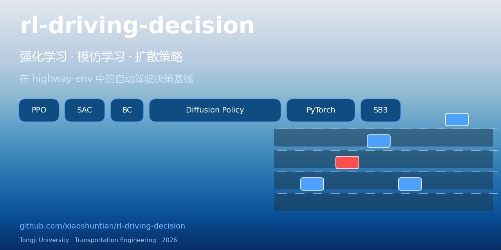
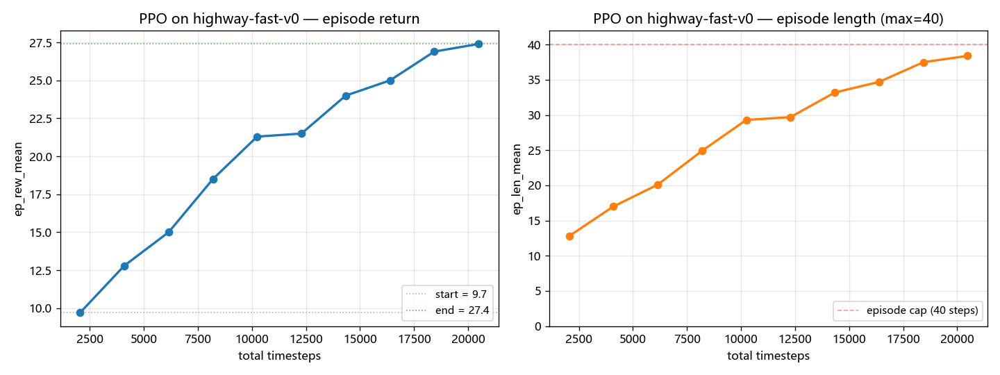

# rl-driving-decision

> Reinforcement-learning baselines for autonomous-driving decision-making in highway-env, with a planned extension to CARLA / nuPlan and Diffusion Policy.



English · [中文说明](README.zh-CN.md)

This is the main personal project for my 2026 summer internship application — a layered comparison of **PPO**, **SAC**, **Behavior Cloning** and **Diffusion Policy** on highway-env scenarios (lane-keeping, lane change, merge), with the explicit goal of reproducing the kind of reward-shaping / closed-loop-eval / policy-fine-tuning workflow described in production planner JDs.

**Author**: Xiao Shuntian (Tongji Univ., Transportation Eng., class of 2027)　|　**Status**: Phase 1 (PPO baseline)

---

## Why this project

Autonomous-driving planning JDs in 2026 keep asking for the same triangle:
- Familiarity with **PyTorch** and a real RL stack (SB3 / CleanRL / TianShou).
- Hands-on with **closed-loop simulation** (highway-env / CARLA / nuPlan).
- Ability to **reproduce papers** (Diffusion Policy, DriveDPO, Hydra-MDP, …).

This repo is the minimum viable demonstration of all three, layered across 3 phases:

| Phase | Goal | Algorithms | Env |
|-------|------|------------|-----|
| 1 (May 2026) | RL baselines run, evaluate, compare | PPO, SAC | highway-env |
| 2 (Jun–Jul) | Add imitation learning + simulator upgrade | + BC, IL warm-start | highway-env / CARLA simplified |
| 3 (Aug+) | Reproduce Diffusion Policy on planning | + Diffusion Policy | highway-env / nuPlan subset |

---

## Repo layout

```
rl-driving-decision/
├── configs/                 # YAML configs (one per algo × env)
├── src/
│   ├── envs/                # highway-env factory + wrappers
│   ├── algos/               # algo registry (PPO, SAC; BC/Diffusion to come)
│   └── utils/               # config loader, seeding
├── scripts/
│   ├── random_rollout.py    # smoke test — random policy, no training
│   ├── train.py             # train an algo from a config
│   └── eval.py              # evaluate a saved model
├── docs/experiment_log.md   # one entry per run
├── assets/                  # demo gifs / figures (kept light)
├── requirements.txt
└── README.md
```

---

## Setup

Tested on Python 3.11 / 3.13, Windows 11 + Ubuntu 22.04, CPU and CUDA.

```bash
# 1. clone
git clone https://github.com/xiaoshuntian/rl-driving-decision.git
cd rl-driving-decision

# 2. create a fresh env (recommended)
python -m venv .venv
# Windows
.venv\Scripts\activate
# macOS / Linux
source .venv/bin/activate

# 3. install
pip install -r requirements.txt
```

> **Windows + OpenMP issue**: if you see `OMP: Error #15: Initializing libiomp5md.dll`, set `KMP_DUPLICATE_LIB_OK=TRUE` in your environment. It's a known torch/numpy interaction on Windows and harmless for our scale.

---

## Quick start

### 1. Smoke test — confirm the env loads

```bash
python scripts/random_rollout.py --config configs/ppo_highway.yaml --episodes 5
```

Expected output: 5 episode returns from a random policy (each typically negative because of collisions).

### 2. Short training run (~30 seconds, sanity check)

```bash
python scripts/train.py --algo ppo --config configs/ppo_highway.yaml --total-timesteps 5000
```

This overrides the configured 200k steps to 5k for a quick check. Tensorboard logs land in `runs/ppo_highway_fast/tb`.

### 3. Full PPO training (~30–90 min on CPU)

```bash
python scripts/train.py --algo ppo --config configs/ppo_highway.yaml
```

```bash
# in another terminal:
tensorboard --logdir runs/ppo_highway_fast/tb
```

### 4. Evaluation

```bash
python scripts/eval.py --algo ppo --config configs/ppo_highway.yaml \
    --model runs/ppo_highway_fast/final_model.zip --episodes 20
```

### 5. SAC (continuous-action variant)

```bash
python scripts/train.py --algo sac --config configs/sac_highway.yaml
```

---

## Results

### Phase 1 · PPO baseline on highway-fast-v0



| metric | value |
|--------|-------|
| total timesteps | 20 480 |
| starting ep_rew_mean | 9.7 |
| **final ep_rew_mean** | **27.4** |
| starting ep_len_mean | 12.8 |
| **final ep_len_mean** | **38.4 / 40** |
| wall-clock (CPU) | ~111 min |

Deterministic evaluation (20 episodes, final model):

| metric | value |
|--------|-------|
| mean return | **27.15 ± 4.66** |
| mean episode length | 38.5 / 40 |
| **crash rate** | **5.0 %** (1/20) |

Within ~10 PPO iterations the agent drops the crash rate from a random-policy ~50% down to 5% and consistently runs out the 40-step episode cap. Phase 2 will warm-start with Behavior Cloning to see if we can halve the required training steps.

Full per-iteration log: [`docs/experiment_log.md`](docs/experiment_log.md).

---

## Roadmap

- [x] Phase 0 — repo skeleton, config-driven training pipeline
- [x] Phase 1 — PPO baseline trained, evaluated, plotted (20k steps, 5% crash rate)
- [ ] Phase 1.5 — SAC baseline + side-by-side comparison
- [ ] Phase 1.6 — full 200k-step PPO run for convergence study
- [ ] Phase 2 — Behavior Cloning module + IL warm-start; CARLA leaderboard-2.0 simplified scenarios
- [ ] Phase 3 — Diffusion Policy reproduction (Chi et al., 2023) and head-to-head comparison on the same scenarios
- [ ] Phase 4 — write up as a 6-8 page technical report under `docs/`

---

## Reproduce the curve in this README

```bash
python scripts/train.py --algo ppo --config configs/ppo_highway.yaml \
    --total-timesteps 20000 > /tmp/train.log 2>&1
python scripts/plot_from_log.py --log /tmp/train.log \
    --title "PPO on highway-fast-v0" --out assets/ppo_highway_fast_reward.png
python scripts/eval.py --algo ppo --config configs/ppo_highway.yaml \
    --model runs/ppo_highway_fast/final_model.zip --episodes 20
```

## Reading list

Papers I'm working through alongside this code:

- Schulman et al., *Proximal Policy Optimization Algorithms* (2017)
- Haarnoja et al., *Soft Actor-Critic* (2018)
- Chi et al., *Diffusion Policy: Visuomotor Policy Learning via Action Diffusion* (2023)
- Liu et al., *DriveDPO* (2024)
- Renz et al., *Hydra-MDP* (NVIDIA, 2024)

## License

MIT — see `LICENSE`.
